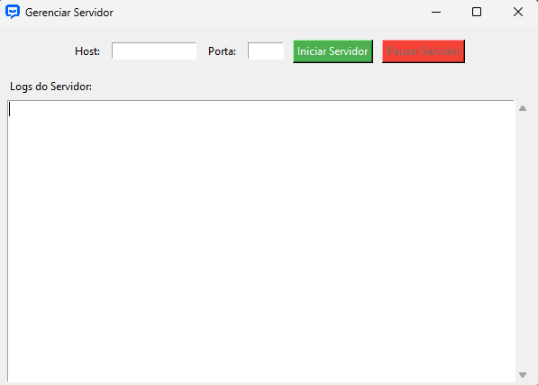
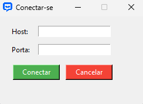
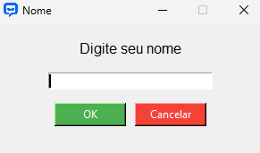
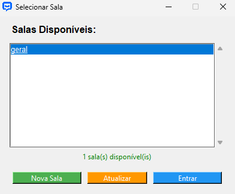
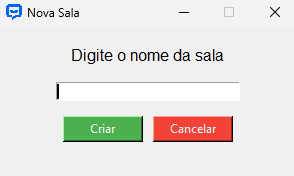
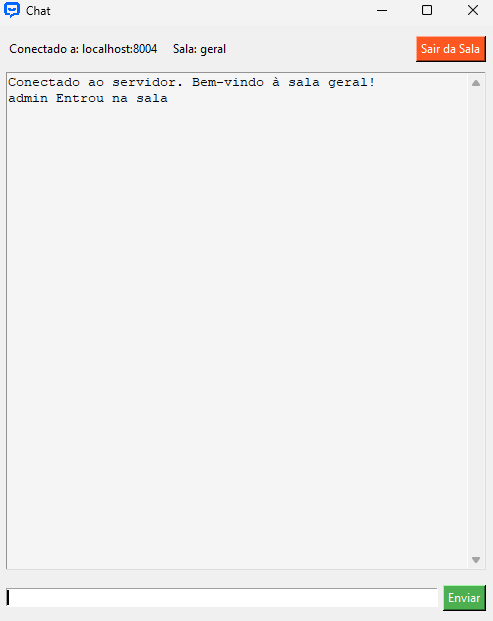

# 💬 Chat Socket

Um sistema de chat em rede desenvolvido em Python, que permite a comunicação em tempo real entre múltiplos usuários através de salas de bate-papo.

## 📋 Funcionalidades

### 🌐 Servidor
- **Gerenciamento de Salas**: Criação e controle de múltiplas salas
- **Monitoramento**: Interface gráfica para acompanhamento de logs
- **Broadcast**: Distribuição de mensagens para todos os usuários da sala
- **Controle de Conexões**: Gerenciamento de conexões dos clientes

### 👥 Cliente
- **Interface Gráfica**: GUI intuitiva para interação
- **Múltiplas Salas**: Capacidade de criar e entrar em diferentes salas
- **Chat em Tempo Real**: Comunicação instantânea entre usuários
- **Notificações**: Avisos de entrada/saída de usuários

## 🛠️ Tecnologias Utilizadas

- Python 3.13.2
- Tkinter (GUI)
- Socket (Comunicação em rede)
- Threading (Processamento paralelo)

## 📦 Instalação

1. Clone o repositório:
```bash
git clone https://github.com/andreLopes41/Chat-Socket
```

2. Navegue até o diretório do projeto:
```bash
cd Chat-Socket
```

3. Execute o servidor:
```bash
python servidor.py
```

4. Execute o cliente em outra janela do terminal:
```bash
python cliente.py
```

## 🎯 Estrutura do Projeto

```
Chat-Socket/
├── servidor.py           # Interface de gerenciamento do servidor
├── cliente.py             # Interface do cliente
└── README.md      # Documentação
```

## 🔒 Regras de Uso

1. **Conexão do Servidor**
   - Configure host e porta válidos
   - Inicie o servidor antes dos clientes
   - Verifique se a porta está disponível

2. **Conexão do Cliente**
   - Use o mesmo host e porta do servidor
   - Escolha um nome de usuário
   - Selecione ou crie uma sala

3. **Chat**
   - Possibilita o envio de mensagens
   - Visualização de mensagens
   - Use a função "Sair da Sala" para desconectar

## 🖼️ Interface do Sistema

**Servidor**



**Cliente - Conexão**



**Cliente - Nome**



**Cliente - Listagem de Salas**



**Cliente - Nova Sala**



**Cliente - Chat**

